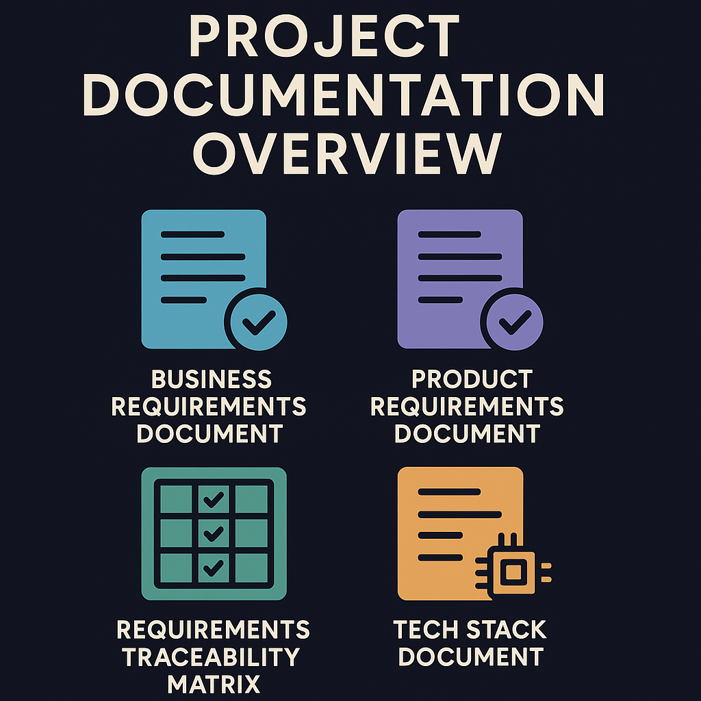

# Project Documentation Overview

This project contains several key documents that provide a comprehensive foundation for your vibe coding platform. Each document serves a specific purpose and is intended for use by different stakeholders throughout the project lifecycle.

## 1. Business Requirements Document (BRD)

- **Purpose:** Defines the high-level business needs, objectives, and expectations for your vibe coding project.
- **Use:** Serves as the foundation for all subsequent project documentation and development activities. It is used by business stakeholders, product managers, and project sponsors to ensure alignment on goals, market opportunities, and success criteria.

## 2. Product Requirements Document (PRD)

- **Purpose:** Translates business requirements into specific product features, functionality, and user stories.
- **Use:** Guides the development team in building the product. It is referenced by product managers, designers, and engineers to understand what needs to be built, for whom, and why. It also defines acceptance criteria for features.

## 3. Requirements Traceability Matrix

- **Purpose:** Maps each business requirement (from the BRD) to corresponding product requirements (from the PRD).
- **Use:** Ensures that all business needs are addressed in the product and that every product feature is justified by a business requirement. It is used for impact analysis, change management, and validation throughout the project lifecycle.

## 4. Tech Stack Document

- **Purpose:** Outlines the technologies, frameworks, tools, and infrastructure components used to build your vibe coding platform.
- **Use:** Provides technical guidance for the engineering team and transparency for stakeholders. It helps ensure consistency, scalability, and maintainability of the platform, and is updated as technology choices evolve.

---

**How to Use These Documents:**

- Start with the BRD to understand the business context and objectives.
- Refer to the PRD for detailed product features and requirements.
- Use the Requirements Traceability Matrix to verify alignment between business needs and product features.
- Consult the Tech Stack Document for technical implementation details and technology decisions.

These documents should be reviewed and updated regularly as the project progresses to ensure continued alignment and clarity for all stakeholders.

## 5. Tools

- **Converter:** Pandoc is a [free-software](https://en.wikipedia.org/wiki/Free_software "Free software") [document converter](https://en.wikipedia.org/wiki/Document_converter "Document converter"), widely used as a writing tool (especially by scholars)^[[2]](https://en.wikipedia.org/wiki/Pandoc#cite_note-:0-2)^ and as a basis for publishing workflows. It was created by [John MacFarlane](https://en.wikipedia.org/wiki/John_MacFarlane_(philosopher)) "John MacFarlane (philosopher)"), a philosophy professor at the [University of California, Berkeley](https://en.wikipedia.org/wiki/University_of_California,_Berkeley "University of California, Berkeley"). More information avaliable [here](https://en.wikipedia.org/wiki/Pandoc) and [hear](https://pandoc.org/index.html).
- **Pandoc license:** GNU General Public License version 2.0 (GPLv2).

## 6. ToDo

1. Update all documents to meet your needs
2. Modify the Tech Stack Documentstion to meet your needs.
3. Replace the .gitignore with one that will work best based on the tech stack or have ai generate one for you.
4. Employ AI as need, giving access to the documentation.
5. Have fun!
